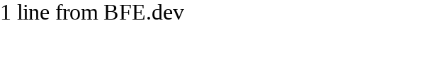
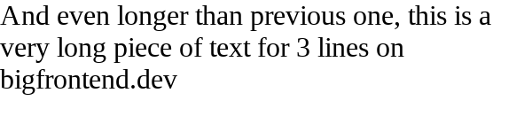
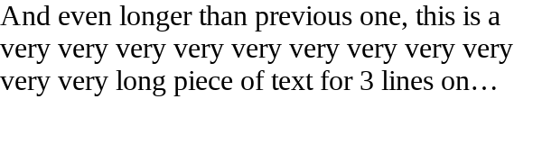

# truncate text in multiple lines(with ellipsis)

Just like 2. truncate text in one line(with ellipsis), please do the same for max 3 lines.

1. short text(1 line)

   

2. short text (2 lines)

   

3. 3 lines(no overflow)

   

4. more than 3 lines

   

[Problem Link](https://bigfrontend.dev/css/truncate-text-in-multiple-lines-with-ellipsis)

```css
.max-three-lines {
  display: -webkit-box;
  -webkit-line-clamp: 3;
  -webkit-box-orient: vertical;
  overflow: hidden;
}
```
