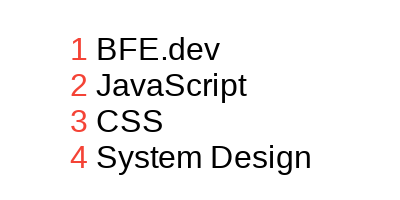

# list numbering

Suppose we have some lists, they could be simple as

```html
<ol>
  <li>BFE.dev</li>
  <li>JavaScript</li>
  <li>CSS</li>
  <li>System Design</li>
</ol>
```

or nested.

```html
<ol>
  <li>BFE.dev</li>
  <li>
    JavaScript
    <ol>
      <li>TypeScript</li>
      <li>Quiz</li>
      <li>
        Framework
        <ol>
          <li>React</li>
          <li>Vue.js</li>
        </ol>
      </li>
    </ol>
  </li>
  <li>CSS</li>
  <li>System Design</li>
</ol>
```

please number the list as below, with color `#f44336` and one space between the number and content.

1. simple list



2. nested


[Problem Link](https://bigfrontend.dev/css/list-numbering)

```css
ol {
  counter-reset: list;
  list-style-type: none;
  margin-left: -13px;
}

li::before {
  counter-increment: list;
  content: counters(list, ".") " ";
  color: #f44336;
}
```
