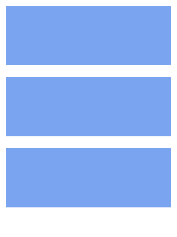

# flex layout 1

Suppose we have to layout a bunch of items with below requirements.

1. fill out to width:100px, but stretch to fill the available space and shrink if not enough
2. stack them if needed

HTML structure is

```html
<div class="container">
  <div class="item"></div>
  <div class="item"></div>
  <div class="item"></div>
</div>
```

1. width:60px


2. width:150px



3. width:250px


4. width:400px


[Problem Link](https://bigfrontend.dev/css/flex-layout-1)

```css
.container {
  display: flex;
  flex-wrap: wrap;
}
.item {
  background-color: #7aa4f0;
  height: 50px;
  margin: 5px;
  flex: 1 1 100px;
}
```
