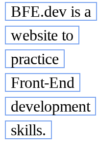

# fragment style

Suppose we have an `<a/>` tag which is streched to multiple lines, add borders to all its fragments.

1. color #7aa4f0 with 1px thickness
2. add 5px padding horizontally for each line

```html
<a class="border">
  BFE.dev is a website to practice Front-End development skills.
</a>
```

1. width:100px



2. width:200px


3. width:500px


[Problem Link](https://bigfrontend.dev/css/fragment-style)

```css
.border {
  line-height: 1.5;
  margin: 5px;
  border: solid 1px #7aa4f0;
  box-decoration-break: clone;
  padding: 0 5px;
}
```
