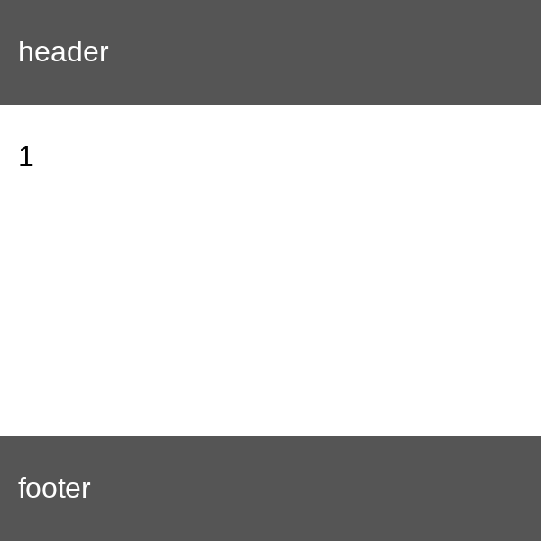
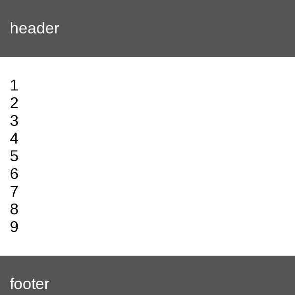
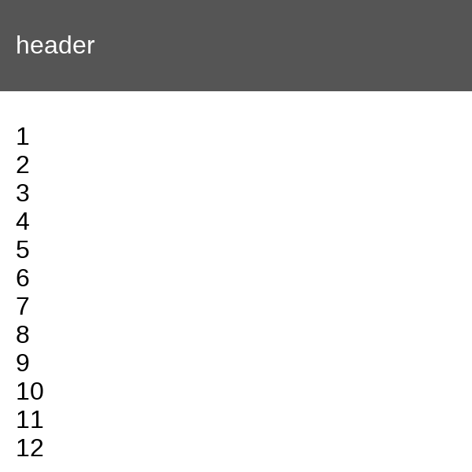

# sticky footer

"Sticky footer" is a layout pattern that

1. if content is short, the footer "sticks" to the bottom
2. otherwise, footer is is displayed after the content as normal.

Suppose we have some HTML structure:

```html
<div class="container">
  <div class="header">header</div>
  <div class="body">content here might be tall , might be short</div>
  <div class="footer">footer</div>
</div>
```

Below is how Sticky Footer pattern should behave.

1. footer sticks to bottom if content is short



2. otherwise footer is displayed as normal



3. event be pushed out from viewport if enough content



[Problem Link](https://bigfrontend.dev/css/sticky-footer)

```css
.container {
  display: flex;
  flex-direction: column;
  min-height: 100vh;
}
.header {
  background-color: #555;
  color: #fff;
  padding: 20px 10px;
}
.body {
  padding: 20px 10px;
}
.footer {
  background-color: #555;
  color: #fff;
  padding: 20px 10px;
  margin-top: auto;
}
```
