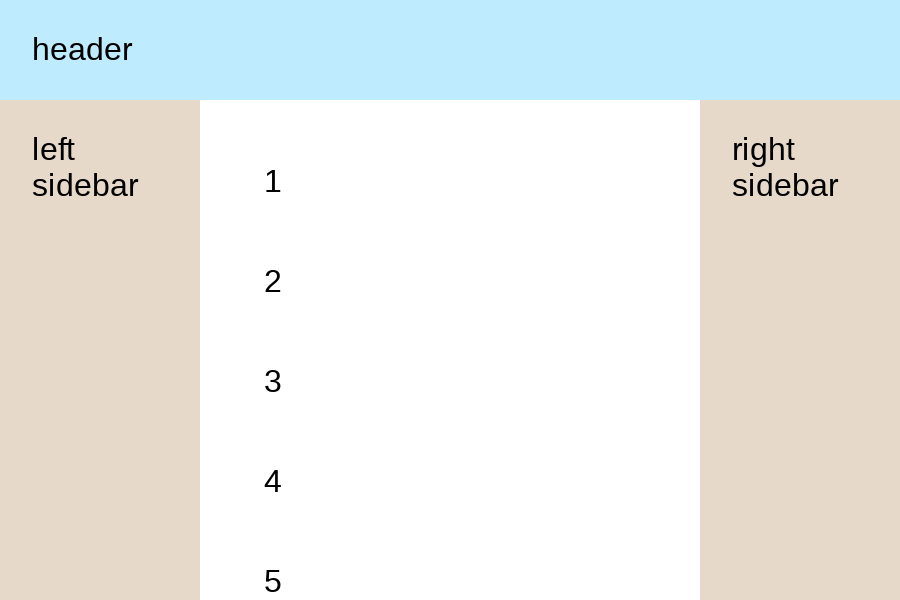

# Holy Grail Layout

Implement Holy Grail Layout which includes header, left sidebar, body, right sidebar and footer.

1. it should be sticky footer
2. left sidebar and right sidebar should be fixed width of 100px.
3. styles of color .etc are already set for you, only layout related CSS code is needed.

```html
<div class="container">
  <header class="header">header</header>
  <div class="left-sidebar">left sidebar</div>
  <div class="body">body</div>
  <div class="right-sidebar">right sidebar</div>
  <footer class="footer">footer</footer>
</div>
```

1. footer sticks to bottom if content is short


2. otherwise footer is displayed as normal


3. event be pushed out from viewport if enough content



[Problem Link](https://bigfrontend.dev/css/Holy-Grail-Layout)

```css

```
