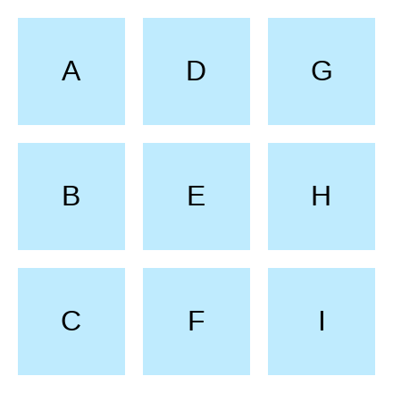

# Grid Layout 1

Layout a 3x3 grid and place `A` to `I` in column-first order.

1. set gap in rows and columns of `10px`
2. container size is already set.

```html
<div class="container">
  <div class="item a">A</div>
  <div class="item b">B</div>
  <div class="item c">C</div>
  <div class="item d">D</div>
  <div class="item e">E</div>
  <div class="item f">F</div>
  <div class="item g">G</div>
  <div class="item h">H</div>
  <div class="item i">I</div>
</div>
```

200x200



[Problem Link](https://bigfrontend.dev/css/grid-layout-1)

```css
.item {
  background-color: #bfebfe;
  display: grid;
  place-items: center;
}

.container {
  display: grid;
  grid-template-rows: repeat(3, 1fr);
  grid-auto-flow: column;
  gap: 10px;
}
```
